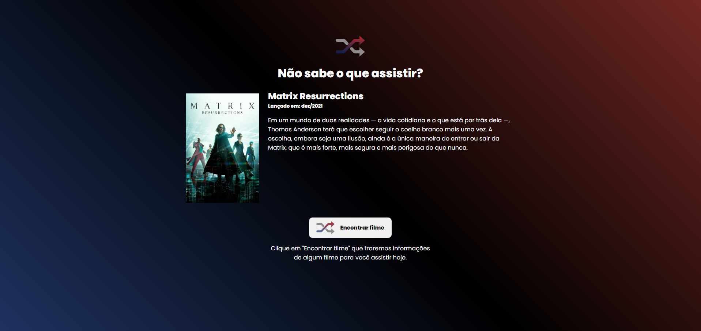

# Rocketflix - Rocketseat Challenge

<a href="https://rocketflix-matricksrocha.vercel.app/"></a>

## 🌍 Website Link

<a href="https://rocketflix-matricksrocha.vercel.app/">https://rocketflix-matricksrocha.vercel.app/</a>

## 📕 About

This website was created as a study challenge from [Rocketseat](https://www.rocketseat.com.br/). Basically, this is a website where the user can click on the button to generate a movie suggestion to watch. Since Rocketseat is a Brazilian website, I have created the website using the Brazilian Portuguese language.

My main objective with this challenge was to improve my skill on API consumption in a real project and also keep improving my HTML, CSS and JavaScript skills.

## 🔨 Tools

- [HTML](https://developer.mozilla.org/en-US/docs/Web/HTML)
- [CSS](https://developer.mozilla.org/en-US/docs/Web/CSS)
- [JavaScript](https://developer.mozilla.org/en-US/docs/Web/JavaScript)
- [Axios](https://axios-http.com/)

## 💻 Executing the Project

To execute the project in your computer:

```bash
# Clone the project
$ git clone https://github.com/MatricksRocha/Rocketflix.git
```

To run the project you need to have live-server on your computer. You can install the Live Server extension on Visual Studio Code or install live-server using the terminal. Using the terminal you will have 2 options: install it only on the root folder of the project or install it globally on your computer (the 2nd option means that the live-server will be available everywhere on your computer).

<strong><u>Using Live Server Extension on VS Code:</u></strong>

To use live-server extension on Visual Studio Code, install the extension using the link below and open the "index.html" file with Live Server: https://marketplace.visualstudio.com/items?itemName=ritwickdey.LiveServer

<strong><u>Using Terminal:</u></strong>

Having Node and npm installed:
```bash
# To install live-server only on the root folder of the project, go to the root folder and run:
$ npm install live-server
```

Or

```bash
# To install live-server globally on your computer:
$ npm install live-server -g
```

```bash
# With live-server installed, you need to start the live-server on the root folder of the project by running:
$ npx live-server
```

## 📝 Developed By

[Matricks Rocha](https://github.com/MatricksRocha) - Frontend Developer <br>
[](https://github.com/MatricksRocha)
[](https://www.linkedin.com/in/matricks-rocha/)